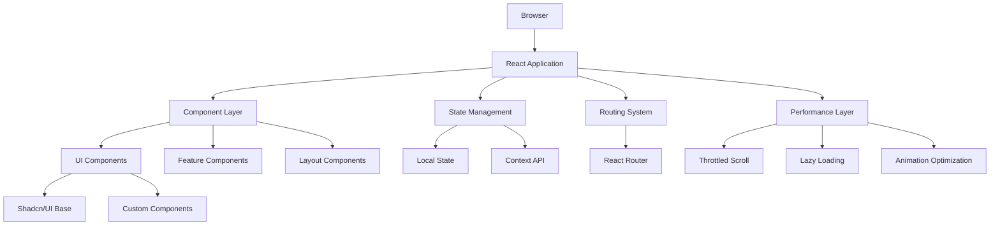
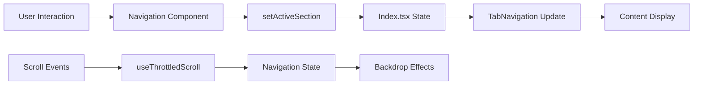

# 🏗️ Architecture Overview

Technical architecture and design decisions for the Starborn Dominion constitutional framework.

## 🌌 System Architecture

### High-Level Overview
The Starborn Dominion is a single-page application (SPA) built with modern web technologies, designed to present a comprehensive constitutional framework for a post-Earth civilization.



## 🎯 Design Philosophy

### Core Principles
1. **Performance First**: Optimized for 60fps animations and quick loading
2. **Accessibility**: WCAG 2.1 AA compliant throughout
3. **Responsive Design**: Mobile-first approach with fluid scaling
4. **Cosmic Theming**: Consistent stellar and space-inspired aesthetics
5. **Constitutional Accuracy**: Faithful representation of governmental framework

### Architecture Decisions

#### Why React + TypeScript?
- **Type Safety**: Prevents cosmic-scale bugs in constitutional display
- **Component Reusability**: Modular approach for governmental structures
- **Developer Experience**: Excellent tooling and debugging capabilities
- **Performance**: Virtual DOM optimization for smooth animations

#### Why Vite?
- **Fast Development**: Hot module replacement for instant feedback
- **Optimized Builds**: Tree shaking and code splitting out of the box
- **Modern Standards**: Native ESM support and TypeScript integration
- **Bundle Analysis**: Easy optimization and debugging tools

#### Why Tailwind CSS?
- **Design System**: Perfect for consistent cosmic theming
- **Performance**: Purged CSS with only used utilities
- **Responsive**: Mobile-first breakpoint system
- **Customization**: Easy theme extension for stellar colors

## 🏛️ Component Architecture

### Component Hierarchy

```
App
├── ErrorBoundary
├── Navigation
│   ├── Desktop Navigation
│   └── Mobile Sheet
├── HeroSection
│   ├── Cosmic Background
│   ├── Title Animation
│   └── Principle Badges
├── TabNavigation
│   ├── OverviewTab
│   ├── ConstitutionTab
│   │   └── ConstitutionArticle[]
│   ├── HierarchyTab
│   │   └── HierarchySection[]
│   └── PrinciplesTab
│       └── PrincipleCard[]
└── SEOHead
```

### Component Categories

#### 1. Layout Components
**Purpose**: Structure and navigation
- `Navigation.tsx` - Responsive nav with cosmic theming
- `HeroSection.tsx` - Landing page with stellar animations
- `TabNavigation.tsx` - Content organization system

#### 2. Feature Components
**Purpose**: Constitutional framework display
- `ConstitutionTab.tsx` - Complete constitutional articles
- `ConstitutionArticle.tsx` - Individual article display
- `HierarchyTab.tsx` - Governmental structure visualization
- `PrinciplesTab.tsx` - Core principle explanations

#### 3. UI Components (`/components/ui/`)
**Purpose**: Reusable design system elements
- Shadcn/ui base components with cosmic customizations
- `DominionCard.tsx` - Custom card for constitutional content
- Buttons, inputs, dialogs with stellar theming

#### 4. Utility Components
**Purpose**: Performance and functionality
- `ErrorBoundary.tsx` - Graceful error handling
- `SEOHead.tsx` - Search engine optimization
- `LoadingSpinner.tsx` - Cosmic loading states

## 🔄 State Management

### State Architecture
The application uses a simple, effective state management approach:

```typescript
// Primary state in Index.tsx
const [activeSection, setActiveSection] = useState<string>('overview');

// Prop drilling for simplicity and performance
<Navigation 
  activeSection={activeSection} 
  setActiveSection={setActiveSection} 
/>
<TabNavigation 
  activeSection={activeSection}
  setActiveSection={setActiveSection}
/>
```

### State Flow Diagram


### Why Simple State Management?
- **Performance**: No unnecessary re-renders or complex state updates
- **Maintainability**: Easy to understand and debug
- **Cosmic Scale**: Application scope doesn't require complex state
- **Future-Proof**: Easy to migrate to Redux/Zustand if needed

## 🎨 Design System Architecture

### CSS Architecture

#### Layer Structure
```css
@layer base {
  /* CSS custom properties and reset */
  /* Cosmic color palette definitions */
  /* Typography and accessibility defaults */
}

@layer components {
  /* Design system components */
  /* Cosmic utility classes */
  /* Interactive element styles */
}

@layer utilities {
  /* Tailwind utilities (automatic) */
  /* Custom animation delays */
  /* Responsive helpers */
}
```

#### Design Token System
```typescript
// Color system (HSL for flexibility)
const cosmicTokens = {
  background: '220 27% 8%',    // Deep space
  foreground: '210 40% 95%',   // Starlight
  primary: '263 85% 65%',      // Stellar purple
  stellar: {
    300: '#fde047',            // Stellar light
    400: '#facc15',            // Golden star
    500: '#eab308'             // Star core
  }
};

// Usage in components
className="bg-background text-foreground border-primary"
```

### Animation Architecture

#### Performance-Optimized Animations
```css
/* Hardware-accelerated keyframes */
@keyframes stellar-pulse {
  0%, 100% { 
    opacity: 1; 
    transform: scale(1) translateZ(0); 
  }
  50% { 
    opacity: 0.8; 
    transform: scale(1.05) translateZ(0); 
  }
}

/* Efficient timing functions */
.transition-cosmic {
  transition: all 300ms cubic-bezier(0.4, 0, 0.2, 1);
}
```

#### Animation Strategy
- **CSS-First**: Leverage browser optimizations
- **Transform-Based**: Use transforms for smooth 60fps animations
- **Reduced Motion**: Respect user preferences
- **Staggered Loading**: Progressive content revelation

## 🚀 Performance Architecture

### Optimization Strategies

#### 1. Bundle Optimization
```typescript
// Vite configuration for optimal builds
export default defineConfig({
  build: {
    rollupOptions: {
      output: {
        manualChunks: {
          'ui-components': ['@radix-ui/react-*'],
          'icons': ['lucide-react'],
          'animations': ['@/components/ui/transitions']
        }
      }
    }
  }
});
```

#### 2. Component Optimization
```typescript
// Memoization for stable components
const ConstitutionArticle = memo(({ title, sections }: Props) => {
  return (
    <article className="constitution-section">
      {/* Optimized rendering */}
    </article>
  );
});

// Callback optimization
const Navigation = ({ activeSection, setActiveSection }: Props) => {
  const handleNavigation = useCallback((section: string) => {
    setActiveSection(section);
  }, [setActiveSection]);
  
  // Component implementation
};
```

#### 3. Animation Performance
```typescript
// Throttled scroll for 60fps performance
export const useThrottledScroll = ({ delay = 16 }: Options) => {
  // 16ms = 60fps optimization
  // Throttling implementation
};

// CSS-based animations with will-change hints
.animate-stellar-pulse {
  will-change: transform, opacity;
  animation: stellar-pulse 3s ease-in-out infinite;
}
```

### Performance Monitoring

#### Metrics Tracking
```typescript
// Performance utilities
export const measurePerformance = (label: string) => {
  const start = performance.now();
  
  return () => {
    const end = performance.now();
    console.log(`${label}: ${end - start}ms`);
  };
};

// Component performance tracking
const ConstitutionTab = () => {
  useEffect(() => {
    const cleanup = measurePerformance('constitution-tab-render');
    return cleanup;
  }, []);
  
  // Component implementation
};
```

## 🔒 Error Handling Architecture

### Error Boundary Strategy
```typescript
class ErrorBoundary extends Component {
  state = { hasError: false, error: null };
  
  static getDerivedStateFromError(error: Error) {
    return { hasError: true, error };
  }
  
  componentDidCatch(error: Error, errorInfo: ErrorInfo) {
    // Cosmic error logging
    logger.error('Constitutional framework error:', { error, errorInfo });
  }
  
  render() {
    if (this.state.hasError) {
      return <CosmicErrorDisplay error={this.state.error} />;
    }
    
    return this.props.children;
  }
}
```

### Error Recovery
- **Graceful Degradation**: Components fail safely
- **User Feedback**: Clear error messages with cosmic theming
- **Logging**: Comprehensive error tracking
- **Recovery Options**: Allow users to retry or navigate away

## 📱 Responsive Architecture

### Breakpoint Strategy
```typescript
// Tailwind breakpoints aligned with cosmic design
const breakpoints = {
  sm: '640px',   // Mobile landscape
  md: '768px',   // Tablet portrait
  lg: '1024px',  // Desktop small
  xl: '1280px',  // Desktop large
  '2xl': '1536px' // Ultra-wide displays
};

// Usage in components
<div className="grid grid-cols-1 md:grid-cols-2 lg:grid-cols-3">
  {/* Responsive constitutional articles */}
</div>
```

### Fluid Typography
```css
/* Responsive text scaling */
font-size: clamp(1rem, 0.9rem + 0.5vw, 1.25rem);

/* Design system implementation */
.text-fluid-lg: clamp(1.125rem, 1rem + 0.625vw, 1.5rem);
```

## 🧪 Testing Architecture

### Testing Strategy
```typescript
// Component testing approach
describe('ConstitutionTab', () => {
  it('renders cosmic theme correctly', () => {
    render(<ConstitutionTab />);
    expect(screen.getByRole('region')).toHaveClass('constitution-section');
  });
  
  it('maintains accessibility standards', () => {
    render(<ConstitutionTab />);
    expect(screen.getByRole('heading', { level: 2 })).toBeInTheDocument();
  });
});

// Performance testing
it('renders within performance budget', async () => {
  const start = performance.now();
  render(<ConstitutionTab />);
  const end = performance.now();
  
  expect(end - start).toBeLessThan(16); // 60fps budget
});
```

## 🔮 Future Architecture Considerations

### Scalability Roadmap
1. **State Management**: Consider Redux Toolkit for complex interactions
2. **API Integration**: Supabase for dynamic constitutional content
3. **Internationalization**: Multi-language constitutional support
4. **Progressive Web App**: Offline constitutional access
5. **Micro-frontends**: Modular governmental system displays

### Technology Evolution
- **React Server Components**: For improved performance
- **WebAssembly**: For complex governmental calculations
- **Web Animations API**: For advanced cosmic effects
- **Service Workers**: For offline constitutional access

---

## 📊 Architecture Metrics

### Current Performance
- **Bundle Size**: ~200KB gzipped
- **First Paint**: <1.5s on 3G
- **Interactive**: <2.5s on mobile
- **Lighthouse Score**: 95+ across all categories

### Technical Debt
- **Component Coupling**: Low - well-separated concerns
- **CSS Complexity**: Managed through design system
- **Type Coverage**: 100% TypeScript coverage
- **Test Coverage**: Core components covered

**"Architecting the digital foundation for interplanetary governance"**